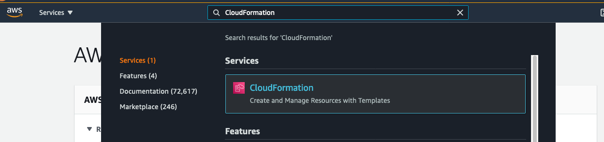
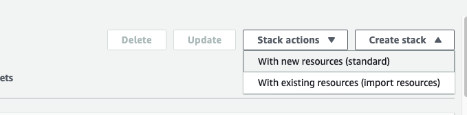
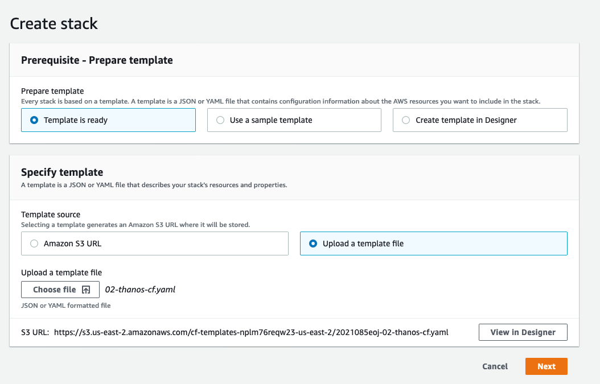
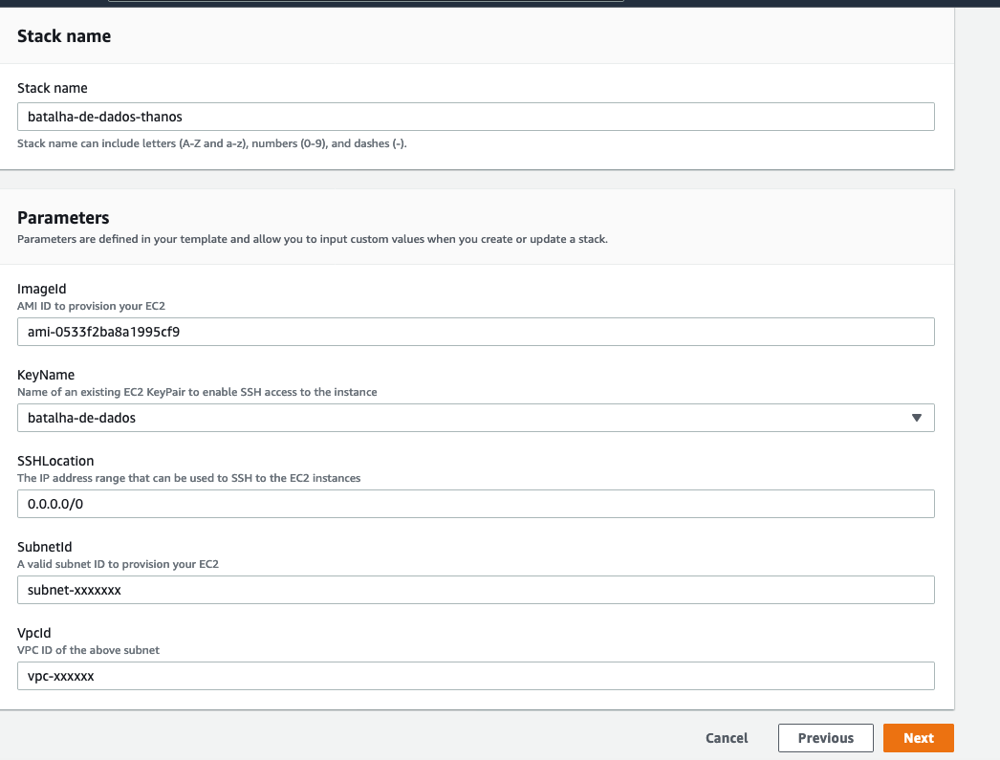
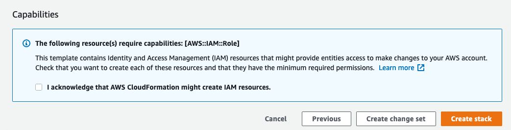

# Como fazer o Deploy dos recursos de Analytics na AWS ?

- [Aprenda como utilizar o Amazon Cloud Formation](https://aws.amazon.com/pt/quickstart)

# Templates Disponiveis

Os recursos são disponiveis para provisionamento utilizando CloudFormation, esses templates são previamente configurados para provisionar os recursos em sua conta AWS de forma mais simples.

Templates disponíveis para a batalha de dados: 

- **SageMaker Notebook:** Esse template provisiona um Notebook para ser utilizado na AWS.

> Jupyter Notebook é uma aplicação web que permite a você criar e compartilhar documentos que contem ao mesmo tempo código interativo e textos explicativos.
